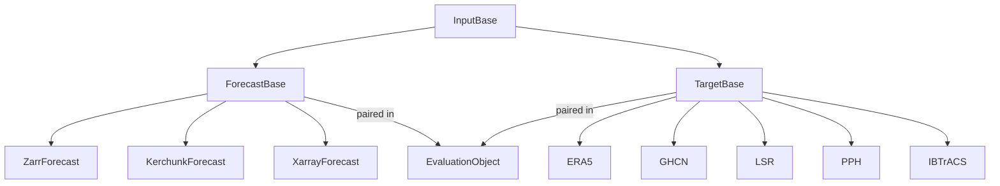

# Data in EWB

EWB works with two distinct kinds of data: **forecasts** from AI weather prediction
models and **targets** that serve as ground truth for evaluation. Keeping them separate
lets you swap either side independently without rewriting your evaluation pipeline. For a
hands-on introduction to setting up a forecast and target together, see [Usage](usage.md);
for real-world wiring examples, see the [Cookbook](recipes/cira_forecast.md).

## Data model overview

Every evaluation pairs one forecast object with one target object inside an
`EvaluationObject`. Both classes inherit from `InputBase`, which handles lazy loading,
variable renaming, and optional preprocessing before any metric is computed.



You can create multiple `EvaluationObject` instances to evaluate the same forecast
against different targets or with different metric sets simultaneously. See
[Usage](usage.md#running-an-evaluation-for-a-single-event-type) for a full example.

## Forecast inputs

All forecast classes extend `ForecastBase` and share four required arguments:

| Argument | Description |
|---|---|
| `source` | Path or URI to the data store |
| `name` | Label used in output DataFrames |
| `variables` | List of CF-convention variable names to select |
| `variable_mapping` | Dict mapping source names → EWB standard names |

Forecasts must expose four dimensions: `init_time`, `lead_time`, `latitude`, and
`longitude`. The `lead_time` dimension must be `timedelta64` — EWB uses it together
with `init_time` to derive `valid_time` at evaluation time.

> **Detailed Explanation**: EWB works in init-time / lead-time space rather than
> valid-time space so it can evaluate forecasts issued from multiple initialization
> times across a case study window. If your data uses different dimension names (e.g.
> `time` for init time, `prediction_timedelta` for lead time), supply a
> `variable_mapping` dictionary to rename them before evaluation. See
> [Variable mapping](#variable-mapping) below.

### ZarrForecast

Use `ZarrForecast` when your forecast is stored in a zarr store — either on cloud
object storage or a local path.

```python
import extremeweatherbench as ewb

hres_forecast = ewb.forecasts.ZarrForecast(
    source="gs://weatherbench2/datasets/hres/2016-2022-0012-1440x721.zarr",
    name="HRES",
    variables=["surface_air_temperature"],
    # built-in mapping for ECMWF HRES from WeatherBench2
    variable_mapping=ewb.HRES_metadata_variable_mapping,
    storage_options={"remote_options": {"anon": True}},
)
```

`storage_options` are passed directly to `xarray.open_zarr`, so any keyword accepted
there (e.g. `token`, `anon`) is valid here.

### KerchunkForecast

Use `KerchunkForecast` when your forecast is referenced via a [kerchunk](https://fsspec.github.io/kerchunk/) `.parq` or
`.json` sidecar file. This is the access pattern used by the CIRA AIWP registry on
AWS Open Data.

```python
import extremeweatherbench as ewb

cira_kerchunk_forecast = ewb.forecasts.KerchunkForecast(
    source="s3://noaa-oar-mlwp-data/FourCastNetv2/kerchunk.parq",
    name="FourCastNetv2",
    variables=["surface_air_temperature"],
    variable_mapping=ewb.CIRA_metadata_variable_mapping,
    storage_options={
        "remote_protocol": "s3",
        "remote_options": {"anon": True},
    },
)
```

Both parquet and JSON kerchunk formats are supported. The underlying engine is
`xarray-kerchunk`. For CIRA models stored in [icechunk](https://icechunk.io/) format, use
`ewb.inputs.get_cira_icechunk()` as a convenience wrapper instead.

### XarrayForecast

Use `XarrayForecast` when you have already opened a dataset in memory — for example,
after assembling a collection of NetCDF files into a single `xr.Dataset`.

```python
import xarray as xr
import extremeweatherbench as ewb

ds = xr.open_mfdataset("my_forecast_*.nc", combine="by_coords")

my_forecast = ewb.forecasts.XarrayForecast(
    ds=ds,
    name="MyModel",
    variables=["surface_air_temperature"],
    variable_mapping={
        "t2m": "surface_air_temperature",
        "prediction_timedelta": "lead_time",
        "time": "init_time",
    },
)
```

`source` and `name` default to `"memory"` and `"in-memory dataset"` respectively.
Providing a descriptive `name` is recommended so evaluation outputs are labelled
correctly in the output DataFrame.

## Target datasets

EWB ships five built-in target classes covering gridded reanalysis, station
observations, storm reports, probabilistic hindcasts, and tropical cyclone tracks.

| Class | Description | Format |
|---|---|---|
| `ERA5` | ECMWF ERA5 reanalysis, 0.25°, hourly | Zarr (GCS, public) |
| `GHCN` | GHCN hourly station observations | Parquet (GCS, public) |
| `LSR` | Local storm reports (US, Canada, Australia) | Parquet (GCS, public) |
| `PPH` | Practically Perfect Hindcast | Zarr (GCS, public) |
| `IBTrACS` | Tropical cyclone tracks from The International Best Track Archive for Climate Stewardship | CSV (NCEI live endpoint) |

### ERA5

`ERA5` is the default gridded reanalysis target. It defaults to the public ARCO ERA5
zarr hosted by Google and requires no credentials:

```python
import extremeweatherbench as ewb

era5_target = ewb.targets.ERA5(
    variables=["surface_air_temperature"],
    storage_options={"remote_options": {"anon": True}},
)
```

Default URI:
```
gs://gcp-public-data-arco-era5/ar/full_37-1h-0p25deg-chunk-1.zarr-v3
```

> **Detailed Explanation**: The ARCO ERA5 store is chunked along the time dimension.
> For best performance, subset variables first, then time, then apply `.sel`/`.isel`
> for latitude and longitude, then rechunk. See
> [this xarray issue comment](https://github.com/pydata/xarray/issues/8902#issuecomment-2036435045)
> for details. The `ERA5` class defaults to `chunks=None`, which defers chunking to
> xarray and generally gives the most efficient access pattern for this store.

### GHCN

`GHCN` provides hourly station observations from the Global Historical Climatology
Network. Data is loaded lazily as a Polars `LazyFrame` and filtered to the case
bounding box at evaluation time.

```python
ghcn_target = ewb.targets.GHCN(variables=["surface_air_temperature"])
```

Default URI:
```
gs://extremeweatherbench/datasets/ghcnh_all_2020_2024.parq
```

Temperature values in GHCN are stored in Celsius; EWB converts them to Kelvin
automatically before computing metrics.

### LSR

`LSR` provides local storm reports from the SPC's report database (US) as well as compiled reports from Canada and Australia. Report types are encoded numerically at metric computation time: wind = 1, hail = 2, tornado = 3. Case date ranges should span 12 UTC to 12 UTC the following day to match the SPC reporting window.

```python
lsr_target = ewb.targets.LSR(
    storage_options={"remote_options": {"anon": True}},
)
```

Default URI:
```
gs://extremeweatherbench/datasets/
    combined_canada_australia_us_lsr_01012020_09272025.parq
```

### PPH

`PPH` provides the Practically Perfect Hindcast — a Gaussian-smoothed observational
proxy used as a skill baseline for severe convection forecasts which uses the LSR data for hail and tornadoes. Unlike `LSR`, it is stored as a zarr on GCS.

```python
pph_target = ewb.targets.PPH(
    storage_options={"remote_options": {"anon": True}},
)
```

Default URI:
```
gs://extremeweatherbench/datasets/
    practically_perfect_hindcast_20200104_20250927.zarr
```

### IBTrACS

`IBTrACS` streams tropical cyclone best track data from the NCEI live CSV endpoint.
EWB pre-processes the raw multi-agency wind and pressure columns using a priority
order (USA → WMO → regional agencies) and converts units from knots to m/s and
hPa to Pa.

```python
ibtracs_target = ewb.targets.IBTrACS()
```

No `storage_options` are required because the data is fetched over HTTPS directly
from NCEI. The IBTrACS class evaluates variables `surface_wind_speed` and
`air_pressure_at_mean_sea_level` by default.

## Variable mapping

`variable_mapping` is a dictionary that maps the names present in your data to the
EWB standard names defined in `defaults.DEFAULT_VARIABLE_NAMES`. You pass it when
constructing any forecast or target:

```python
my_mapping = {
    "t2m": "surface_air_temperature",     # 2-m temperature → EWB name
    "u10": "surface_eastward_wind",        # 10-m U wind → EWB name
    "v10": "surface_northward_wind",       # 10-m V wind → EWB name
    "prediction_timedelta": "lead_time",   # timedelta dim → EWB name
    "time": "init_time",                   # init-time dim → EWB name
}
```

EWB applies the mapping lazily — only keys present in the data are renamed, so it is
safe to include extra entries for variables you may not always use.

Three built-in mappings are provided in `extremeweatherbench.inputs`:

| Mapping | Use with |
|---|---|
| `ERA5_metadata_variable_mapping` | `ERA5` target or ERA5-formatted forecasts |
| `HRES_metadata_variable_mapping` | ECMWF HRES from WeatherBench2 |
| `CIRA_metadata_variable_mapping` | CIRA AIWP models via kerchunk or icechunk |

The `ERA5` and `IBTrACS` target classes apply their respective built-in mappings by
default, so you typically do not need to set `variable_mapping` when using them.

## Supported source backends

`IncomingDataInput` is the union type accepted at every data boundary in EWB:

```python
IncomingDataInput = xr.Dataset | xr.DataArray | pl.LazyFrame | pd.DataFrame
```

The `sources/` subpackage contains a protocol-based backend for each type; EWB
selects the correct one automatically based on the runtime type of your data.

- **`xr.Dataset`** — the primary backend for gridded forecasts and the `ERA5` and
  `PPH` targets.
- **`xr.DataArray`** — supported where a single-variable array is sufficient;
  converted to `Dataset` internally before metric computation.
- **`pl.LazyFrame`** — used by `GHCN` and `IBTrACS` for efficient lazy subsetting of
  large tabular files without loading the full dataset into memory.
- **`pd.DataFrame`** — used by `LSR` and available for custom targets that produce
  in-memory tabular data.

## Climatology reference data

`get_climatology()` in `extremeweatherbench.defaults` opens a 1990–2019 ERA5 surface
air temperature climatology:

```
gs://extremeweatherbench/datasets/
    surface_air_temperature_1990_2019_climatology.zarr
```

It accepts a `quantile` argument (either `0.15` or `0.85`) and returns the
corresponding percentile field as an `xr.DataArray`. This climatology is used
internally by `DurationMeanError` for heat wave and freeze evaluations — you do not
need to load it manually unless you are writing a custom threshold metric.

```python
from extremeweatherbench.defaults import get_climatology

# 85th-percentile threshold used for heat wave duration metrics
heat_threshold = get_climatology(quantile=0.85)
```

## A note on network I/O

All EWB data objects open datasets lazily — no data is transferred until a metric is
computed. For zarr and parquet sources, only the chunks or rows needed for a given
case are fetched at compute time. Running locally on a consumer connection is feasible
but can be significantly slower than running inside a cloud VM co-located with the
data on GCS. See [A Note on Parallelism](parallelism.md) for guidance on tuning
`n_jobs` and chunk sizes to balance throughput and memory usage.
