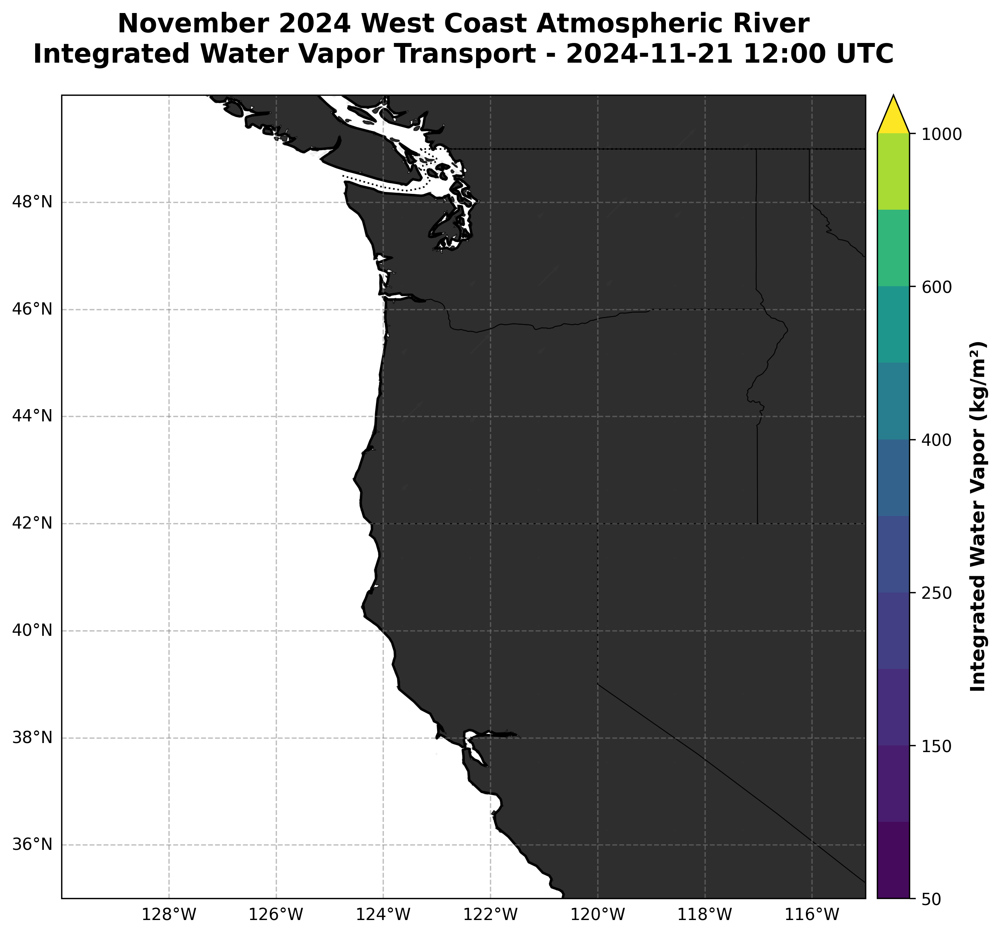

# November 2024 West Coast US Atmospheric River Event

## Event Overview

**Event ID:** 97  
**Title:** November 2024 West Coast US  
**Event Type:** Atmospheric River  
**Start Date:** November 20, 2024, 00:00 UTC  
**End Date:** November 22, 2024, 00:00 UTC  
**Duration:** 48 hours  

## Geographic Location

**Region Type:** Bounded Region  
**Latitude Range:** 35.0°N - 50.0°N  
**Longitude Range:** 230.0°E - 245.0°E (130.0°W - 115.0°W)  
**Affected Areas:** Pacific Northwest (Washington, Oregon), Northern California, Western Canada

## Event Description

This atmospheric river event impacted the West Coast of the United States from November 20-22, 2024. The event was characterized by a strong moisture transport from the Pacific Ocean, bringing significant precipitation to the Pacific Northwest and Northern California regions.

Atmospheric rivers (ARs) are narrow corridors of concentrated water vapor in the atmosphere that transport moisture from tropical and subtropical regions to higher latitudes. They are responsible for much of the precipitation along the U.S. West Coast, particularly during winter months.

## Meteorological Significance

- **Peak Intensity:** November 21, 2024 (middle of event period)
- **Primary Variables:** Integrated Water Vapor Transport (IVT), precipitation, surface winds
- **Scale:** Regional impact across multiple states and provinces
- **Seasonal Context:** Late fall/early winter atmospheric river event

## Regional Impact

The bounded region (35.0°N-50.0°N, 230.0°E-245.0°E) encompasses:
- **Washington State:** Seattle, Tacoma, Bellingham metropolitan areas
- **Oregon:** Portland, Eugene, coastal regions
- **Northern California:** San Francisco Bay Area, Sacramento Valley
- **Western Canada:** British Columbia coastal regions

## Scientific Context

This event represents a typical autumn/winter atmospheric river affecting the U.S. West Coast. Such events are:
- Critical for regional water supply
- Associated with flood risks in vulnerable areas
- Linked to orographic precipitation enhancement in mountainous regions
- Important for drought relief in California

## Analysis Framework

This case study is part of the ExtremeWeatherBench dataset, designed to evaluate model performance in predicting atmospheric river events. The event provides a valuable test case for:
- Moisture transport prediction accuracy
- Precipitation timing and intensity forecasts
- Regional impact assessment capabilities

## Peak Event Visualization

The plot above shows the Integrated Water Vapor Transport during the peak of the atmospheric river event on November 21, 2024, displaying the characteristic narrow corridor of moisture transport from the Pacific Ocean to the West Coast.

## Data Sources and References

- ExtremeWeatherBench Case Study Database
- ERA5 Reanalysis Data
- NOAA/NWS Atmospheric River Observations
- Center for Western Weather and Water Extremes (CW3E)

## Related Documentation

- [Atmospheric Rivers Overview](../AtmosphericRivers.md)
- [All Case Studies](../AllCaseStudies.md)
- [Case Study YAML Details](../CaseStudyYamlDetails.md)
